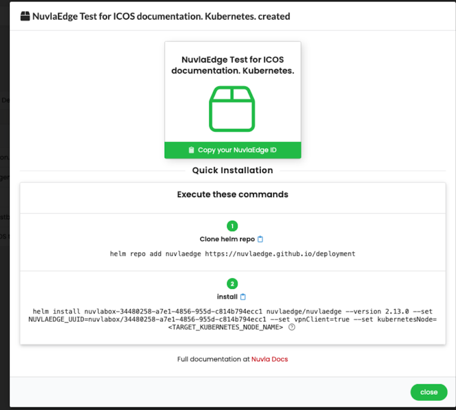
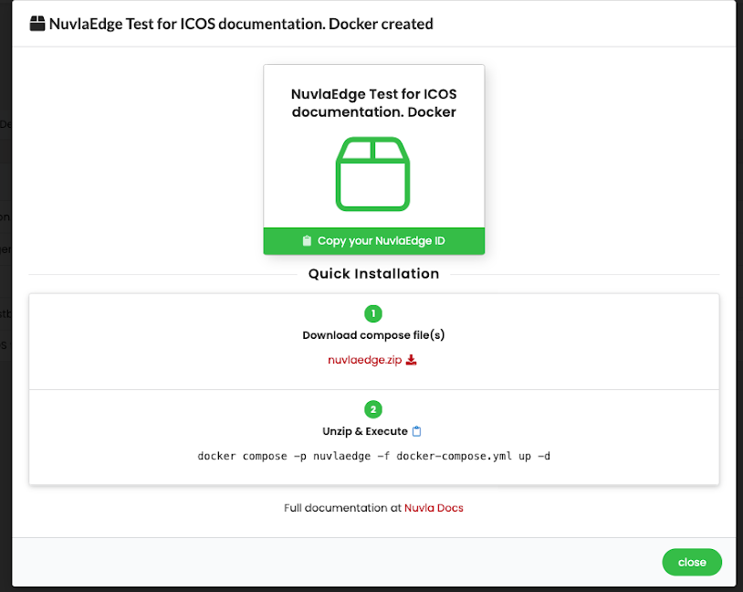

# Nuvlaedge Deployment
The procedure to deploy a NuvlaEdge to a node (here a node is a hardware device� a bare-metal server,
 Virtual Machine, Raspberry Pi, Nvidia Jetson etc) is provided by the [Nuvlaedge installation documentation](https://docs.nuvla.io/nuvlaedge/installation/).
The hardware requirements are provided in the [Nuvlaedge hardware requirements documentation](https://docs.nuvla.io/nuvlaedge/installation/requirements/#hardware-requirements) .

## Software
The NuvlaEdge can be installed using either Docker or Kubernetes. 
This depends on how the containers that you will deploy to your node are defined.Either as 
docker compose files or kubernetes manifests. 
The software requirements for Docker and Kubernetes are provided in the 
[Nuvlaedge software requirements documentation](https://docs.nuvla.io/nuvlaedge/installation/requirements/#software-requirements).

### Docker 
For example, the following sequence commands will install the required Docker components to an Ubuntu-based OS:

```console
apt update

apt-get install ca-certificates curl gnupg

install -m 0755 -d /etc/apt/keyrings

curl -fsSL https://download.docker.com/linux/ubuntu/gpg | sudo gpg --dearmor \
-o /etc/apt/keyrings/docker.gpg

chmod a+r /etc/apt/keyrings/docker.gpg

echo   "deb [arch=$(dpkg --print-architecture) signed-by=/etc/apt/keyrings/docker.gpg] https://download.docker.com/linux/ubuntu \
$(. /etc/os-release && echo "$VERSION_CODENAME") stable" |   sudo tee /etc/apt/sources.list.d/docker.list > /dev/null

apt update

apt-get install docker-ce docker-ce-cli containerd.io docker-buildx-plugin \
docker-compose-plugin docker
```


### Kubernetes
For Kubernetes we recommend [k3s](https://k3s.io/). 
To install k3s follow the [k3s documentation](https://docs.k3s.io/quick-start).
You need to copy and edit the Kubernetes configuration file (```$HOME/.kube/config```) 
so that the IP address in the line:

* **server**: https://127.0.0.1:6443 

is the IP address of the node not the loopback address.

```console
cp /etc/rancher/k3s/k3s.yaml $HOME/.kube/config
<edit $HOME/.kube/config>
```

You also need to install [Helm](https://helm.sh) following the [official installation instructions](https://helm.sh/docs/intro/install/).

### NuvlaEdge
The instructions to install a NuvlaEdge to a node can be found in the [official documentation](https://docs.nuvla.io/nuvlaedge/installation/).

For each case, Docker and Kubernetes, the instructions are in the [install with the compose file](https://docs.nuvla.io/nuvlaedge/installation/install-with-compose-files/)

and [install with helm](https://docs.nuvla.io/nuvlaedge/installation/install-with-helm/) instructions respectively.

In each case, the installation via UI guides with the same instructions:

<figure markdown="1">
{: style="width:460px;"}
</figure>
<p style="text-align: center;font-size:13px;color:blue;">Fig.1: Nuvla Edge UI guides kubernetes</p>

and

<figure markdown="1">
{: style="width:460px;"}
</figure>
<p style="text-align: center;font-size:13px;color:blue;">Fig.1: Nuvla Edge UI guides docker</p>
