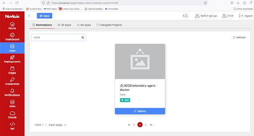
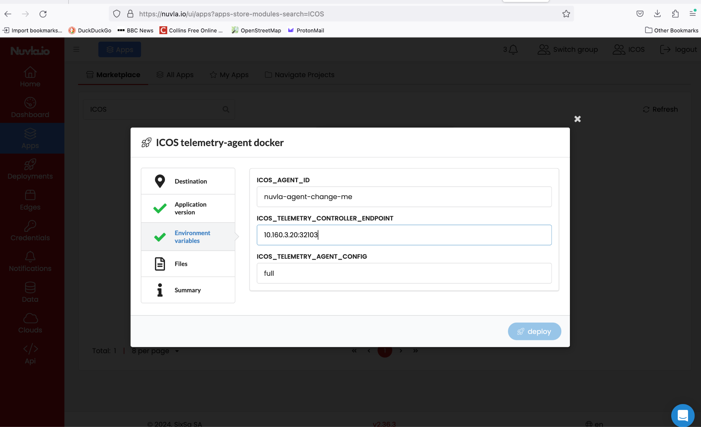
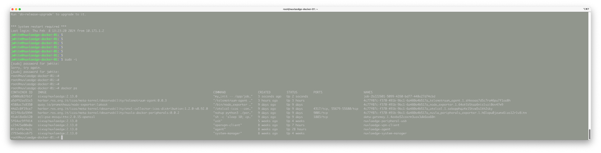

# Telemetry Agent Installation

The ICOS Telemetry Agent is the ICOS module that is responsible for collecting the status and 
the performance of resources (hardware, system, containers, processes) at the host level 
(device, board, Virtual Machine). 
This component is **mandatory** and **must be installed in all the hosts that are part of the ICOS Agent** 
(e.g., all the K8s clusters in OCM all the devices registered in Nuvla).

The Telemetry Agent **needs to connect to the Telemetry Controller module**
(deployed in the ICOS Controller) to send the data collected using either HTTP or gRPC protocols. 
For this reason, outgoing connectivity should be ensured from the Telemetry Agent to the 
Telemetry Controller.

Depending on the technology used, two installation methods are available (see below):

- **if** OCM is used as orchestrator, **then** the Telemetry Agent installation should be done 
  in all the Kubernetes clusters that are part of OCM;
- **if** Nuvla is used as orchestrator, **then** the Telemetry Agent installation should be done 
  in each edge device.

## **OCM-Kubernetes Installation**
The installation of the Telemetry Agent in a Kubernetes (or compatible) cluster is done using 
an Helm chart.

As a prerequisite, [Helm](https://helm.sh) must be installed to use the chart (follow the instructions 
in the [Helm's documentation](https://helm.sh/docs/) to get started).

### Step 1 - Configure and Install 
Run the Helm installation command (making sure that the correct kubernetes config file is taken):

```console
helm upgrade --install --namespace icos-system telemetry-agent oci://harbor.res.eng.it/icos/helm/telemetry-agent --set telemetryControllerEndpoint=10.160.3.236:32103 --set agentId=icos-agent-x

```
??? note

	**Note 1**: this command uses the default Kubernetes kubeconf file (the same used by kubectl). 
	To change it, either define a new location with the **KUBECONFIG** environment variable 
	(e.g., export KUBECONFIG=/my/location) or use the 
	```bash
		helm kubeconfig /my/location 
	```
	flag.

	**Note 2**: use endpoint *10.160.3.236:32103* for nodes that will join the UC Controller, 
	while use endpoint *10.160.3.20:32103* for nodes that will join the staging testbed.

### Step 2 - Verify
If the installation is successful, multiple pods are created (the number depends on the number of nodes 
in the cluster and the configuration options). At least a prometheus-node-exporter, an otel-node-agent, 
and one otel-target-allocator pod should be up and running. 

```console

kubectl get pods -n icos-system

|NAME                                                           | READY | STATUS  | RESTARTS | AGE  |
| ------------------------------------------------------------- | ------| ------- | -------- | -----|
|telagent-prometheus-node-exporter-jbd9v                        | 1/1   | Running |  0       |  15h |
|telagent-telemetry-agent-otel-node-agent-m5rwx                 | 1/1   | Running |  0       |  15h |
|telagent-telemetry-agent-otel-target-allocator-66d4984684-7wthp| 1/1   | Running |  0       |  15h |

```
If data is sent correctly to the ICOS Controller, the new host should be visible in the 
[Grafana dashboards](to add the link of the dashboard). 
Errors related to the transmission of data can be troubleshooted by looking at the logs of the 
**otel-node-agent** pod.

??? note
	Note: In order to install versions not yet released, the url of the chart needs to be changed to 
	
	```bash
	oci://harbor.res.eng.it/icos-private/helm/telemetry-agent
	```
	. 
	
	In addition, since unreleased versions are private, you need to login to the repository before 
	launching the install command: 
	```
	helm registry login harbor.res.eng.it/icos-private/helm and provide your credentials.
	```
## **Nuvla-Docker Installation**

In the case that the Docker version of NuvlaEdge is being used, the ICOS Telemetry Agent is
Available as a Nuvla App. 
The general procedure to deploy and run an App on a NuvlaEdge can be found at: 
`https://docs.nuvla.io/nuvla/user-guide/run-app/`.

The telemetry agent can be installed directly from the Nuvla UI. 
Assuming that the Docker NuvlaEdge is installed (see Section YYY):

- Login to nuvla.io
- Switch to the ICOS group
- Select Apps
- Select the ICOS telemetry-agent docker App

<figure markdown="1">
{: style="width:800px;"}
</figure>

- Deploy the App to your NuvlaEdge as provided in the [NuvlaEdge User Guide](https://docs.nuvla.io/nuvla/user-guide/run-app/)

When making the deployment, some environment variables need to be filled in:

* ICOS_AGENT_ID <the ID of your ICOS agent>
* ICOS_TELEMETRY_CONTROLLER_ENDPOINT <the IP:PORT of the ICOS telemetry controller
* ICOS_TELEMETRY_AGENG_CONFIG <full | no-logs >

<figure markdown="1">
{: style="width:800px;"}
</figure>


Once deployed, you can check on the NuvlaEdge node that some docker containers have got started:

<figure markdown="1">
{: style="width:800px;"}
</figure>