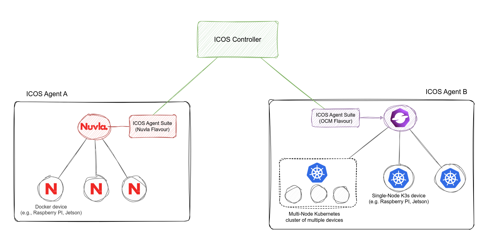

# ICOS Agent

The ICOS Agent consists of one, or multiple computational resources (devices, VMs, physical servers) 
that are controlled by ICOS. 
ICOS does not control the resources directly, but relies on a *local orchestrator* to know 
which hosts are available and to 'deploy/configure/un-deploy' workloads on them. 
At the moment ICOS supports OCM and Nuvla as orchestrators. 
In this guide we will assume an orchestrator for the node deployed available and configured. 
 
The installation of ICOS software to run an ICOS Agent can be broken down into two different steps:

- **Installation of the ICOS Agent Suite**: It includes the installation of all the ICOS services 
needed to manage the agent (e.g., Deployment Manager).This installation needs to be done once per-agent.
- **On-boarding of the resources**: This step requires the registration of the 
computational resources in the local orchestrator (if not yet done) plus the installation 
of the ICOS specific software on the host. It needs to be repeated for each host of the agent.

In the figure 1, highlight the relationship between the ICOS software and the local orchestrators 
in an ICOS Agent.

During the installation, the following information will be needed:

- The endpoint of an ICOS Controller (i.e., Telemetry Controller and Job Manager URLs);
- The endpoint of the ICOS Identity and Access Management (IAM) and the credentials to allow the 
  new ICOS Agent to authenticate;
- Credentials to access [Nuvla.io](https://nuvla.io/ui/) (only if the Nuvla orchestrator is used);
- Credentials and endpoint to access the [Wazuh server](https://wazuh.com/install/).

<figure markdown="1">
{: style="width:360px;"}
</figure>

Fig.1: Nuvla Edge with ICOS Controller

-   :books:__Set up ICOS Agent__

    ---

    Install ICOS Agent and running in 5 minutes

    [&rarr; Getting started](installation.md)

-   :books:__Set up Telemetry Agent__

    ---

    Install ICOS Telemetry Agent and running in 5 minutes

    [&rarr; Installation](../Computational Resources/telemetryagent.md)

    

