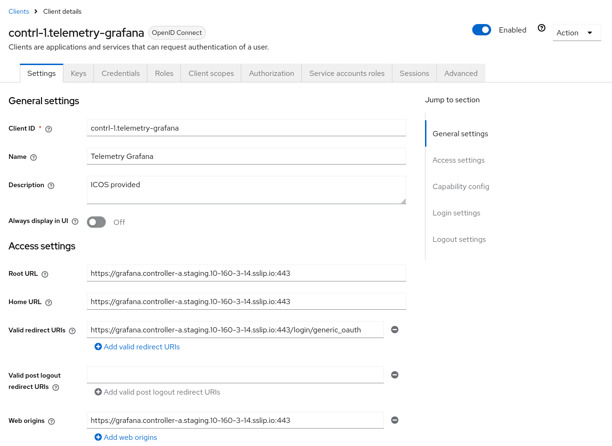
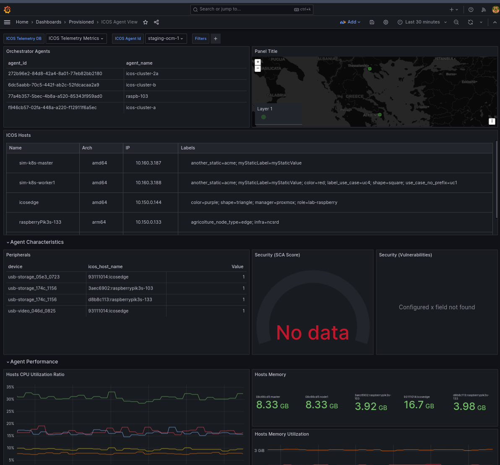

# Telemetry Dashboards

Each ICOS Controller includes a Grafana instance to support ICOS administrators to visualize the metrics collected in the system through a set of pre-defined dashboards. Since this interface is not meant to be used directly by ICOS Application Integrators, it is not exposed by default to the extern.

## Access to Grafana

The Grafana instance is deployed by default in each ICOS Controller, but not exposed to the extern by default. There are two ways to access it:

1. (temporary solution) use the `kubectl port-forward` command[^1]:
   ```bash
   # namespace and service name to be customized
   kubectl -n icos-system port-forward svc/contrl1-grafana 3000:3000
   ```

2. (permanent solution) modify the ICOS Controller release Helm values to expose Grafana:
   ```yaml
   global:
     controller:
       telemetry:
         exposeGrafana: true
   ```
   In this case, Grafana will be exposed accordingly to the exposure settings defined for the ICOS Controller (see [Exposure](../../Developer/Suites/Exposure.md) section)

Once Grafana is exposed it is possible to open its URL in the browser and **log-in**:

1. using the `admin` user. The password can be retrieved from the cluster in the `<Release Name>-grafana-admin` secret:
   ```bash
   # namespace and service name to be customized
   kubectl -n icos-system get secret contrl1-grafana-admin -o jsonpath='{.data.password}' | base64 -d
   ```

2. Using the ICOS IAM service (Click on **Sign-in with ICOS IAM***). This require the IAM Service to be properly configured. Please refer to the next section: [IAM Congfiguration for Grafana](#iam-configuration-for-grafana).

### IAM Configuration for Grafana

In order to use the IAM service to log-in in Grafana, an ad-hoc configuration is needed for the OpenID Client created for Grafana.

1. Open the Grafana client details
2. Set the `Root URL`, `Home URL`, `Web origins` fields to the public URL of Grafana (make sure to also add the port even if it is the standard one - e.g. `:443`)
3. Set the `Valid redirect URIs` to the Grafana public URL + `/login/generic_oauth`

<figure markdown="span">
{ align=center }
  <figcaption>ICOS Agent View Dashboard</figcaption>
</figure>

4. In the `Client scopes` section, make sure that the following scopes are enabled and added as `Default`: `email`, `offline_access`, `profile` and `roles`.

5. In the `Roles` section, create the following roles: `admin`, `editor`, `viewer`.


More information can be retrieved also from the official [Grafana documentation](https://grafana.com/docs/grafana/latest/setup-grafana/configure-security/configure-authentication/keycloak/#keycloak-configuration).


## ICOS Agent View Dashboard

The **ICOS Agent View** dashboards provide an overview of the entire ICOS Continuum.

<figure markdown="span">
{ align=center }
  <figcaption>ICOS Agent View Dashboard</figcaption>
</figure>


[^1]: https://kubernetes.io/docs/tasks/access-application-cluster/port-forward-access-application-cluster/