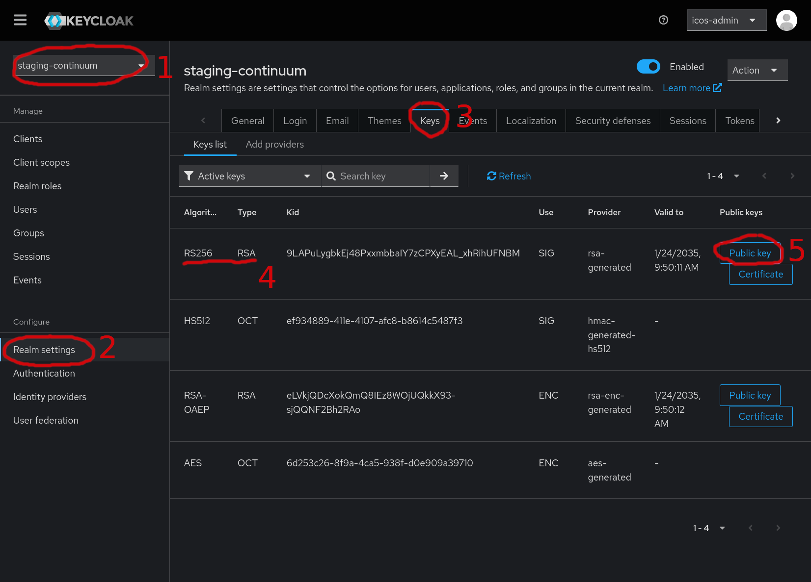
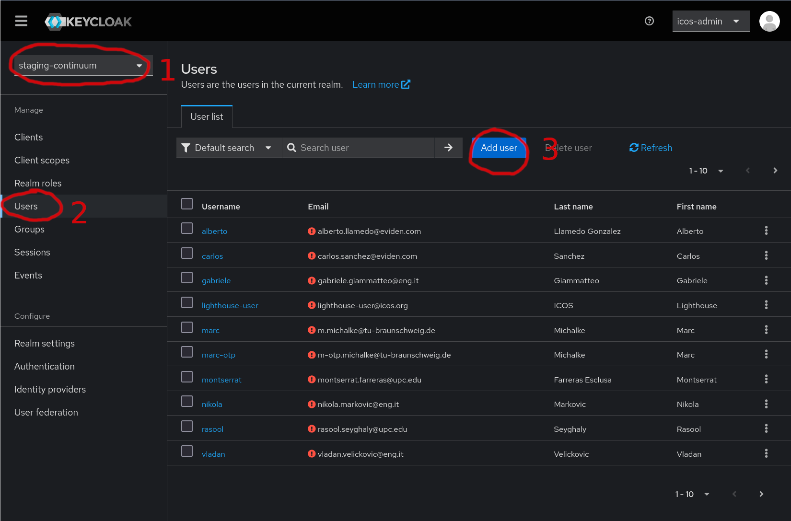
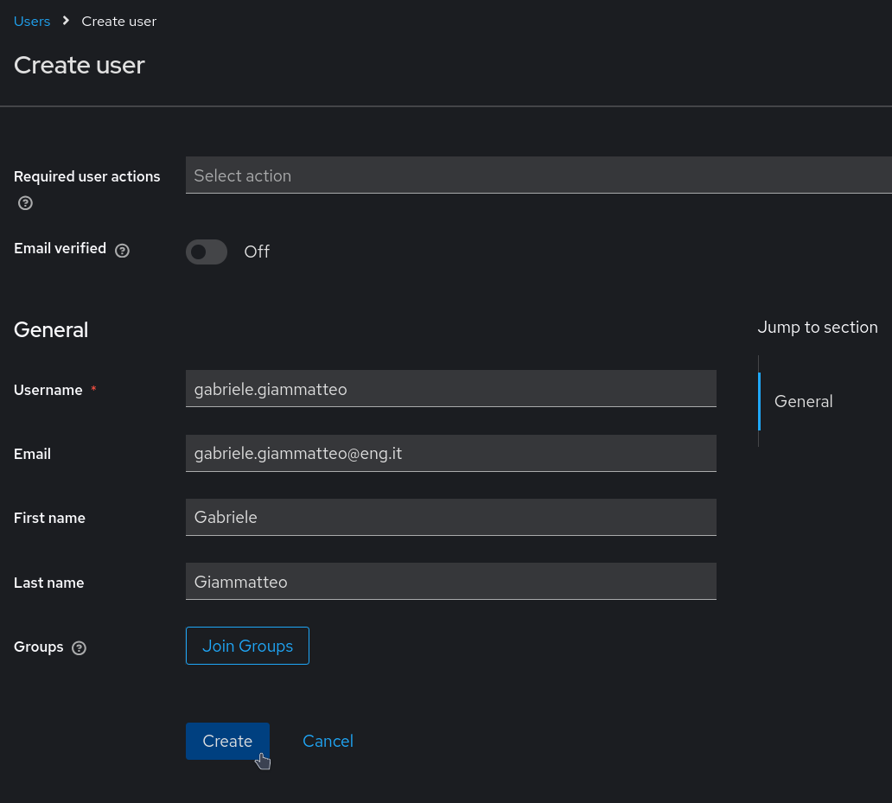
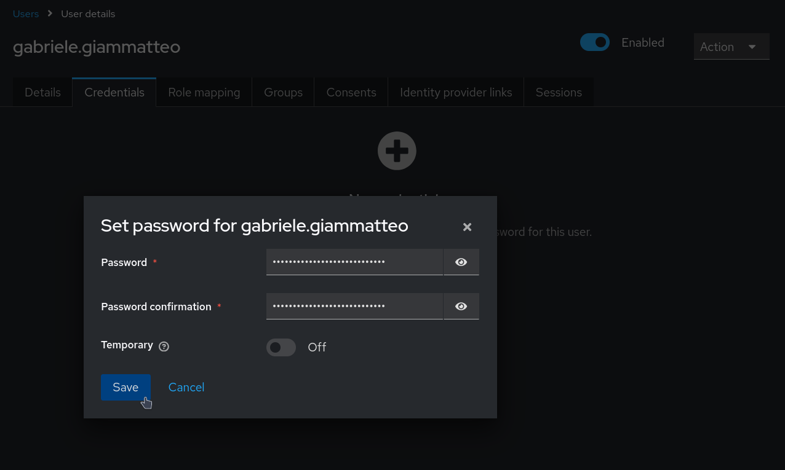

# IAM Service

All operations within the ICOS Continuum require authentication and proper authorization before execution. 
These functionalities are provided by the Identity and Access Management (IAM) component, 
which is invoked in nearly all interactions between components and is integral to the realization 
of all functionalities.

Three scenarios are analyzed to demonstrate how:

1. Users' authentication and authorization are achieved.
2. Service-to-Service authentication and authorization is achieved.
3. Cross-Controller identities and authorization are achieved.

The IAM component manages users who are Application Integrators interacting with ICOS for 
deploying and managing their applications. 
This does not include end users of the applications or devices within the Cloud Continuum.

All workflows rely on the [OAuth2.0 protocol](https://oauth.net/2/) for communication between components, ensuring state-of-the-art security, trust, 
and an easy integration with both existing and new components.


## Access the Keycloak Administration Console

Keycloak comes with a web-based administration console that can be used to administer the users and services. The exact endpoint depends on the exposure configuration of the ICOS Core deployment (see [Service Exposure](../../Developer/Suites/Exposure.md) section). 


To access the console:

1. open the URL (e.g. `https://iam.core.my-continuum.com/`) in the browser.
2. the user is `icos-admin`
3. the password can be retrieved directly from the Kubernetes cluster where the ICOS Core is running:
   ```bash
   kubectl get secret -n <icos-core-namespace> core1-iam-passwords -o jsonpath="{.data.admin-password}" | base64 -d
   ``` 

A more detailed usage guide can be found in the [Keycloak Administration Guide](https://www.keycloak.org/docs/latest/server_admin/index.html).


## Retrieve the IAM Public Key

The Keycloak Server Public Key is the key used to verify the tokens issued by the server. It is required as configuration parameter of the ICOS Controller and ICOS Agent Suites.

To retrieve the public key, first log-in to the Keycloak Administration Console ([see here](IAM.md#access-the-keycloak-administration-console)). Then:

1. Select the realm
2. Click on **Realm Settings**
3. Click on the **Keys** tab
4. Locate the `RSA256 - RSA` key
5. Click on the **Public Key** button and copy the key shown


<figure markdown="span">
{ align=center }
  <figcaption>Get the Public Key</figcaption>
</figure>


## Create a user

To create a new user, first log-in to the Keycloak Administration Console ([see here](IAM.md#access-the-keycloak-administration-console)). Then:

1. Select the realm
2. Click on **Users**
3. Click on **Add User**

<figure markdown="span">
{ align=center }
  <figcaption>Create User - Step 1</figcaption>
</figure>

In the wizard, fill-in the user details and click on **Save**

!!! warning
    Make sure also `email`, `First name` and `Last name` fields are filled. They are required to have a valid user

<figure markdown="span">
{ align=center }
  <figcaption>Create User - Step 2</figcaption>
</figure>


Finally, set a password for the new user:

1. Click on the **Credentials** tab
2. Click on **Set Password**
3. Specify the new password. Make sure to un-check the **Temporary** option
4. Click on **Save**

<figure markdown="span">
{ align=center }
  <figcaption>Create User - Step 3</figcaption>
</figure>


## Create an OpenId Connect client

To be completed. For the moment, please refer to the official Keycloak documentation [here](https://www.keycloak.org/docs/latest/server_admin/index.html#proc-creating-oidc-client_server_administration_guide).