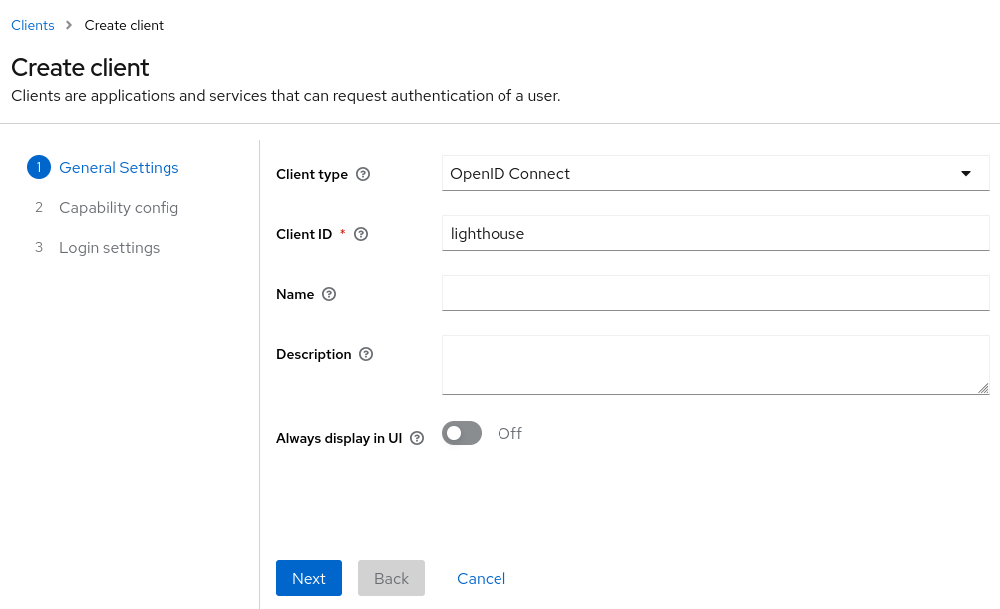
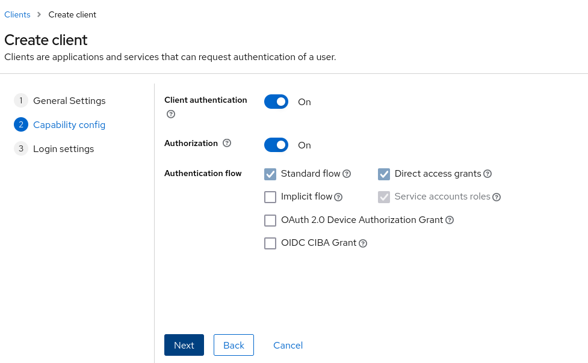
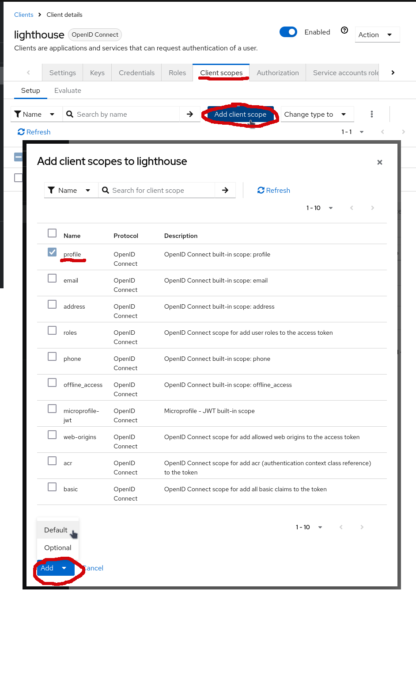
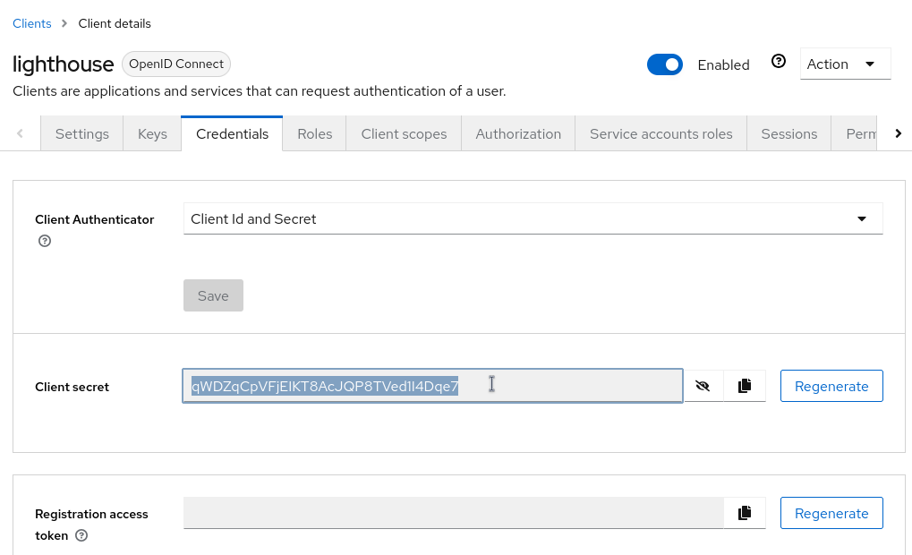

# Deploy the ICOS Core

The ICOS Core Suite deploys the three services needed to bootstrap a new ICOS Continuum:


- the **ICOS CA**: responsible for issuing TLS certificates to all continuum services,

- the **ICOS Identity and Access Management (IAM) service**: used to authenticate and authorize requests and users in the continuum,

- the **ICOS Lightouse**: used to register ICOS Controllers to the system.

The ICOS Core Suite is an Helm chart that deploys and configures the three components.

The installation of a new ICOS Core **is done in multiple steps** because some configuration parameters are generated during the deployment itself. In particuar, in the first step the CA's Root Certificate is generated and it is used in the following steps to configure the certificates issuer component.

!!! warning
    A full guide with more deployemnt schemas and options is available in the [Developers guide](../../Developer/Suites/Core.md).

!!! example "Helm and Kuebctl commands"
    All **Helm** and **Kubectl** commands in this page assumes that the Kubernetes configuration of the cluster where to perform the installation is available in the default location (`~/.kube/config`) or specified through the `KUBECONFIG` env variable. Refer to the [Helm Guide](https://helm.sh/docs/helm/helm/) for more options.

    In the example, the `icos-core` namespace and the `core1` release name will be used. They can be customized if needed.


## Step 1 - Install the Suite (without the Certificates Issuer)

In this step, the ICOS Core Suite is installed using Helm, but the Certificates Issuer component will be disabled and will be installed during the next steps.

Create a `values.yaml` file to sepficy how to expose the ICOS Core services (for an in-depth guide see the [Services Exposure](../../Developer/Suites/Exposure.md) section):

```yaml linenums="1"
global:
  core:
    url: https://core.icos-stable.10-160-3-236.sslip.io/
    routing: host

# needed if routing is "host" or "path" AND no other instances of the "icos-ingress-controller" are already installed in the cluster
icos-ingress-controller:
  enabled: true
```

!!! warning "Exposure"
    The values for `url`, `routing` and `icos-ingress-controller` must be carefully chosen since they will determin how the services of the ICOS Core will be exposed. Make sure to **read carefully and fully understand** the guide to these values in the [Developers Guide](../../Developer/Suites/Exposure.md#icos-ingress-controller).

    In the provided example, services will be exposed using a LoadBalancer service routing the different services using DNS names.


??? info "Persistence"
    The default values, will also create two Kubernetes Persistent Volumes to store IAM db and CA db. They can be disabled using the following Helm values:
    ```yaml linenums="1"
    icos-iam:
      keycloak:
        postgresql:
          primary:
            persistence:
              enabled: false
    icos-ca:
      step-certificates:
        ca:
          db:
            persistent: false
    ```
    Keep in mind that disabling persistence can be dangerous because data (users and certificates database) will be lost in case of restart of the pods.


Now, run the installation command with:

```
helm install --namespace icos-core --create-namespace core1 oci://harbor.res.eng.it/icos/helm/icos-core --values values.yaml --set icos-ingress-controller.step-issuer.icos-issuer.enabled=false
```


## Step 2 - Initialize the IAM Service

After the `keycloak` pod is ready, it is possible to access the **Keycloak Web Administration Console** from the browser to configure it. The exact URL to access the console, will depend on the `url` and `routing` Helm values chosen for the installation.

The user for Keycloak is `icos-admin`.

The default password for the admin user is autogenerated and can be retrieved with the following command:

```
kubectl get secret -n icos-core core1-iam-passwords -o jsonpath="{.data.admin-password}" | base64 -d
```

After the login:

1. Create a new realm for the ICOS Continuum (e.g. "my-icos-continuum").

2. Create a new Client named `lighthouse` with "Client Authentication" and "Authorization" capabilities enabled.

<figure markdown="span">
{ align=center }
  <figcaption>Lighthouse client creation step 1</figcaption>
</figure>

<figure markdown="span">
{ align=center }
  <figcaption>Lighthouse client creation step 2</figcaption>
</figure>

3. Add the `profile` scope as default for the new client: goto the `lighthouse` client details page; select `Client scopes`; click on `Add client scope`; select the `profile` client; click on `Add` and then on `Default`.

<figure markdown="span">
{ align=center }
  <figcaption>Lighthouse client configuration</figcaption>
</figure>

4. ake note of the `clientSecret` generated.

<figure markdown="span">
{ align=center }
  <figcaption>Lighthouse client creation step 3</figcaption>
</figure>


## Step 3 - Collect CA certificates and secrets

Before proceeding, take note of some CA generated values:

- `ca bundle`: 
    ```
    kubectl exec --namespace icos-core core1-step-certificates-0 -- sh -c "step ca root | step base64"
    ```

- `ca issuer kid`
    ```
    kubectl get configmap --namespace icos-core core1-step-certificates-config -o jsonpath="{.data['ca\.json']}" | jq .authority.provisioners[0].key.kid
    ```

- `ca issuer password`
    ```
    kubectl get secret --namespace icos-core core1-step-certificates-provisioner-password -o jsonpath='{.data.password}' | base64 --decode
    ```


## Step 4 - Upgrade the Suite configuration

Edit the `values.yaml` file and add the values collected in the previous steps:
```yaml linenums="1" hl_lines="5-12"
global:
  core:
    url: https://core.icos-stable.10-160-3-236.sslip.io/
    routing: host
    ca:
      bundle: <value for the "ca bundle" retrieved in previous steps>
      issuerKid: <value for the "ca issuer kid" retrieved in previous steps>
      issuerPassword: <value for the "ca issuer password" retrieved in previous steps>
    iam:
      realm: <name of the Keycloak realm created in the previous step>
    lighthouse:
      iamClientSecret: <value of the client secret for the Keycloak's "lighthouse" client created in the previous step>

# needed if routing is "host" or "path" AND no other instances of the "icos-ingress-controller" are already installed in the cluster
icos-ingress-controller:
  enabled: true
```

Run the `helm upgrade` command (with issuer enabled):
```
helm upgrade --namespace icos-core core1 oci://harbor.res.eng.it/icos/helm/icos-core --values values.yaml
```

??? tip
    If you get the following error:

    ```
    Error: UPGRADE FAILED: resource mapping not found for name: "icos-step-ca-issuer" namespace: "" from "": no matches for kind "StepClusterIssuer" in version "certmanager.step.sm/v1beta1"
    ```

    fix it by running the following and re-executing the previous command:
    ```bash
    kubectl apply -f https://raw.githubusercontent.com/smallstep/helm-charts/refs/heads/master/step-issuer/crds/certmanager.step.sm_stepclusterissuers.yaml
    kubectl apply -f https://raw.githubusercontent.com/smallstep/helm-charts/refs/heads/master/step-issuer/crds/certmanager.step.sm_stepissuers.yaml
    ```

Finally, force the re-creation of the step-issuer and lightouse pods:
```
kubectl delete pod --namespace icos-core -l "app.kubernetes.io/name=step-issuer"
kubectl delete pod --namespace icos-core -l "app.kubernetes.io/name=icos-lighthouse"
```


If the installation is successful, the following pods should be running and in `Ready` status:

```bash
❯ kubectl get pods -n icos-core
NAME                                                              READY   STATUS    RESTARTS   AGE
core1-cert-manager-cainjector-6bcd4d946-wr9kv                     1/1     Running   0          24h
core1-cert-manager-controller-6d8fffd985-927bw                    1/1     Running   0          24h
core1-cert-manager-webhook-584654d5-c4kxp                         1/1     Running   0          24h
core1-icos-lighthouse-b7b44b6dc-6jn2b                             1/1     Running   0          20h
core1-keycloak-0                                                  1/1     Running   0          24h
core1-nginx-ingress-controller-default-backend-5cd59c4c4b-khfmj   1/1     Running   0          24h
core1-nginx-ingress-controller-fddbd549-m87ss                     1/1     Running   0          24h
core1-postgresql-0                                                1/1     Running   0          24h
core1-step-certificates-0                                         1/1     Running   0          24h
core1-step-issuer-67578656cd-94tx2                                2/2     Running   0          24h
```

If the installation is working properly, after few minutes the following three certificates should have been created and in status `Ready`:
```bash
❯ kubectl get certificate -n icos-core
NAME                           READY   SECRET                         AGE
core1-ca-ingress-tls           True    core1-ca-ingress-tls           24h
core1-iam-ingress-tls          True    core1-iam-ingress-tls          24h
core1-lighthouse-ingress-tls   True    core1-lighthouse-ingress-tls   24h
```