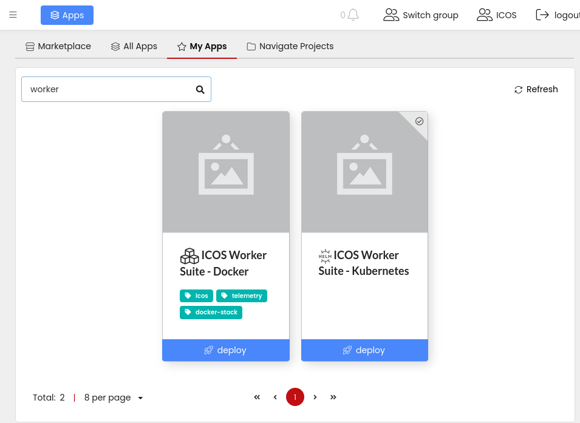
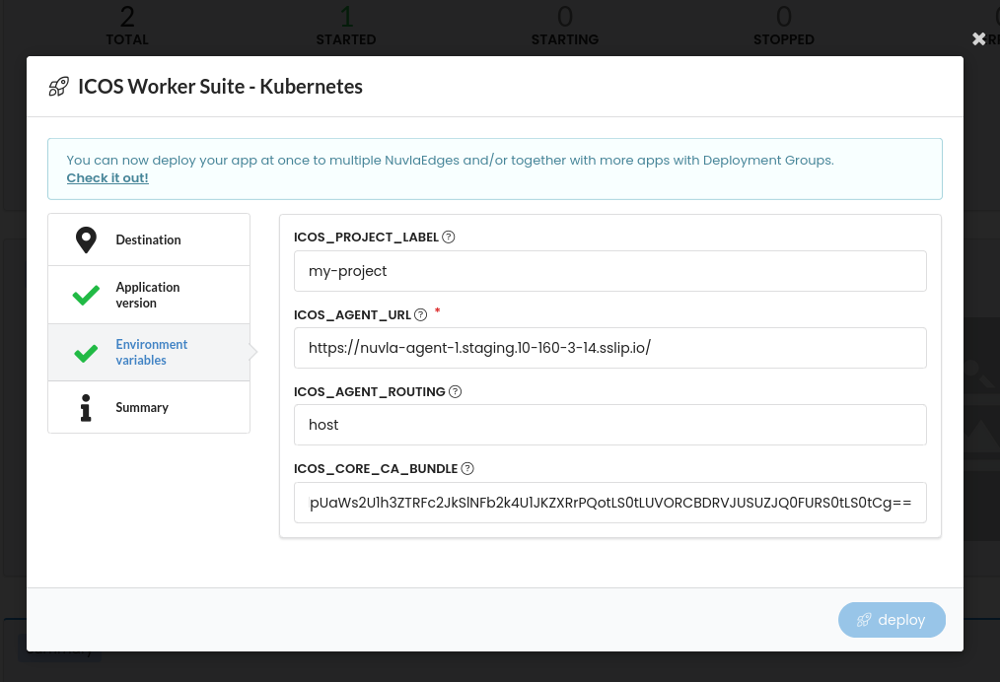

# Install the ICOS Worker Suite

The ICOS Worker Suite installs all the ICOS mandatory (and some optional) components needed for an ICOS Worker. The table below summarizes the components installed by the Suite.

| Component                 | Purpose                                                        | Mandatory |
| ------------------------- | -------------------------------------------------------------- | :-------: |
| Telemetruum Leaf          | Agent for the ICOS Telemetry                                   |    ✓      |
| DataClay                  | Agent for the ICOS Data Management                             |           |
| Telemetry DataClay Bridge | Bridge to make telemetry data available in the Data Management |           |


Depending on the runtime platform (Docker or Kubernetes) and the orchestrator used, different installation methods are available (see below).

## **OCM Installation**

The installation of the ICOS Worker SUite in a Kubernetes (or compatible) cluster is done using the **ICOS Worker Suite Helm Chart**.

As a prerequisite, [Helm](https://helm.sh) must be installed to use the chart (follow the instructions 
in the [Helm's documentation](https://helm.sh/docs/) to get started).

The Helm Chart accepts many values that can be used to customize the installation and enable/disable some features. More documentation can be found on [GitHub](https://github.com/icos-project/ICOS-Worker-Suite).

Create a `values.yaml` file with the following values:

```yaml
global:
  # Configuration of the ICOS Agent to which this Worker will join
  agent:
    routing: host
    url: https://agent.example.com/
  
  # ICOS CA Root Certificate (in base64 encoding). Optional, only needed if HTTPS
  # protocol is used in the ICOS Agent URL
  core:
    ca:
      bundle: LS0tLS1CR....0tLS0tCg

# Optional: specify custom labels to assign to all nodes of this Worker
telemetruum-leaf:
  telemetruum-leaf-exporter:
    staticHostsLabels:
      my_label: my_value

```

In particular:

- the `global.agent.url` and `global.agent.routing` values are mandatory and are needed to determin to which endpoint this ICOS Worker will register. These values can be retrieved from the ICOS Agent Suite's helm values.

Run the Helm installation command (making sure that the correct kubernetes config file is taken):

```console
helm install --namespace icos-system --create-namespace wrk1 oci://harbor.res.eng.it/icos/helm/icos-worker --values values.yaml
```

!!! important "Upgrade"
    
    In order to upgrade the Telemetruum Leaf to the latest version, run the same command replacing `install` with `upgrade`.

??? example "Development version"
	
	Note: In order to install versions not yet released, the url of the chart needs to be changed to 
	
	```bash
	oci://harbor.res.eng.it/icos-private/helm/icos-worker
	```
	
	In addition, since unreleased versions are private, you need to login to the repository before 
	launching the install command: 
	```
	helm registry login harbor.res.eng.it/icos-private/helm and provide your credentials.
	```

If the installation was successful, a set of pod should have been started in the cluster and telemetry data for this agent should be sent to the controller and being visible in the [ICOS Agent View Dashboard](../ICOS%20Controller/telemetry-dashboards.md#icos-agent-view-dashboard)

```bash
> kubectl get pods -n icos-system
NAME                                                           READY   STATUS    RESTARTS   AGE
wrk1-kube-state-metrics-564bcff5b6-kc2b4                       1/1     Running   0          16h
wrk1-prometheus-node-exporter-5jhxp                            1/1     Running   0          16h
wrk1-prometheus-node-exporter-gbs5x                            1/1     Running   0          16h
wrk1-telemetruum-leaf-otel-node-agent-7wt8x                    1/1     Running   0          3h3m
wrk1-telemetruum-leaf-otel-node-agent-mknbd                    1/1     Running   0          3h2m
wrk1-telemetruum-leaf-otel-target-allocator-64bf5694dc-ghvcz   1/1     Running   0          16h
wrk1-telemetruum-leaf-telemetruum-leaf-exporter-6z6n4          1/1     Running   0          3h3m
wrk1-telemetruum-leaf-telemetruum-leaf-exporter-8qgkt          1/1     Running   0          3h3m
```

## Nuvla Installation

For workers that uses the Nuvla orchestrator, the installation of the ICOS Worker Suite should be done through the Nuvla portal using the two Nuvla Apps `ICOS Worker Suite - Docker` or `ICOS Worker Suite - Kubernetes` depending on the worker runtime platform.

The procedure is the following:

1. Login to nuvla.io
2. Select Apps
3. Select the `ICOS Worker Suite - Docker` or `ICOS Worker Suite - Kubernetes` App:
   

4. Deploy the App to your NuvlaEdge as provided in the [NuvlaEdge User Guide](https://docs.nuvla.io/nuvla/user-guide/run-app/)

When preparing the deployment, some environment variables and configuration files need to be customized:

- for the **Kuberentes** app:

    | Variable              | Description                           |
    | --------------------- | ------------------------------------- |
    | `ICOS_AGENT_URL`      | Mandatory. URL of the ICOS Agent      |
    | `ICOS_AGENT_ROUTING`  | Optional. Defaults to `host`          |
    | `ICOS_CORE_CA_BUNDLE` | Optional. The ICOS CA Root Cert       |
    | `ICOS_PROJECT_LABEL`  | Custom value for the `project` labael |

    Values are the same used for the OCM installation. Please refer to the [OCM Section](#ocm-installation)

- for the **Docker** app:

    | Variable                          | Description                                                                                                  |
    | --------------------------------- | ------------------------------------------------------------------------------------------------------------ |
    | `ICOS_TELEMETRUUM_GATEWAY_ENDPOINT` | Mandatory. The endpoint to send telemetry. This is derived from the ICOS Agent URL, but it is not the same   |
    | `ICOS_TELEMETRUUM_LEAF_EXTRA_ARGS`  | Optional. Additional arguments. For instance to set a label `--static-host-label test_static=docker-staging` |

    | File                   | Content                         |
    | ---------------------- | ------------------------------- |
    | `extracertsbundle.pem` | ICOS CA Root Cert in PEM format |


Other variables are available to further customize the installation.





## Customization

The Worker Suite instllation can be customized enabling/disabling some components or manually setting some worker properties.

### Host Labels and Location
Temetry module will work well in most of the cases with the default configuration and will discover automatically some information on the device (e.g., ip, location, labels).

It is possible to manually override some of this data in various way described in the [Host Configuration](../../Developer/Components/telemetruum/Telemetruum Leaf/host-configuration.md) section.

### Energy Consumption Metrics
Energy consumption metrics are disabled by default. They can be activated (if supported by device CPU) with the following value:

```yaml

telemetruum-leaf:
  scaphandre:
    enabled: true|false
```
