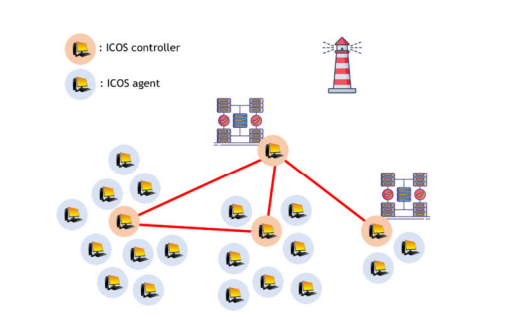
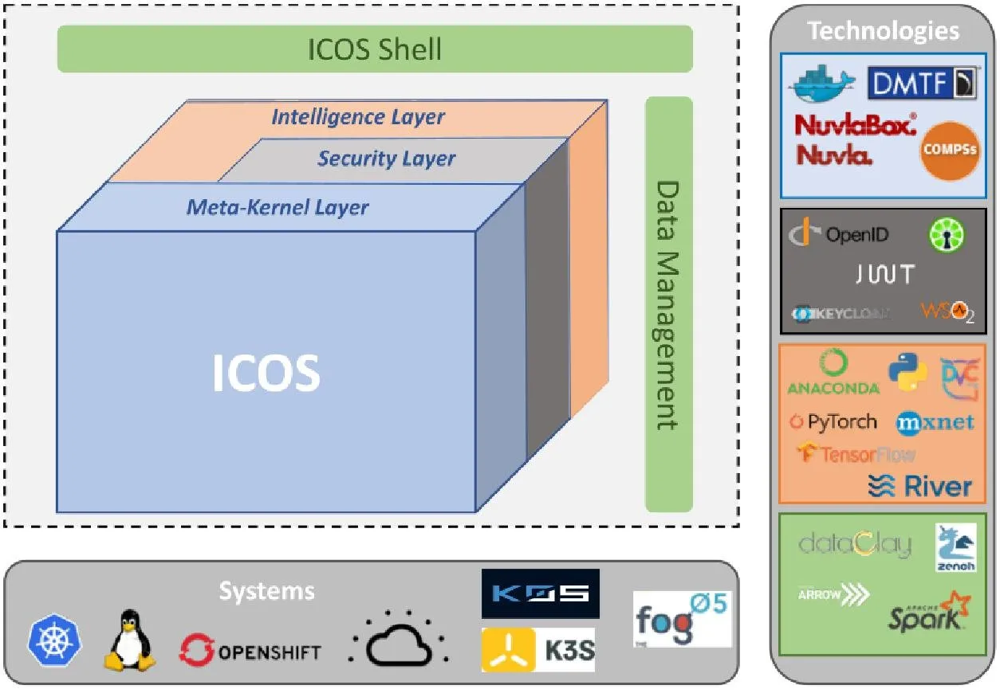
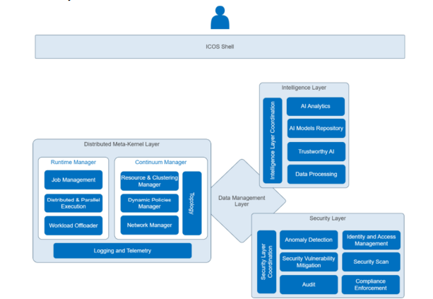
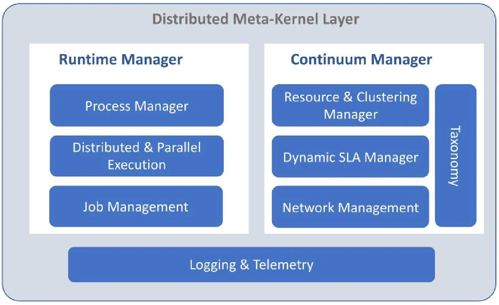
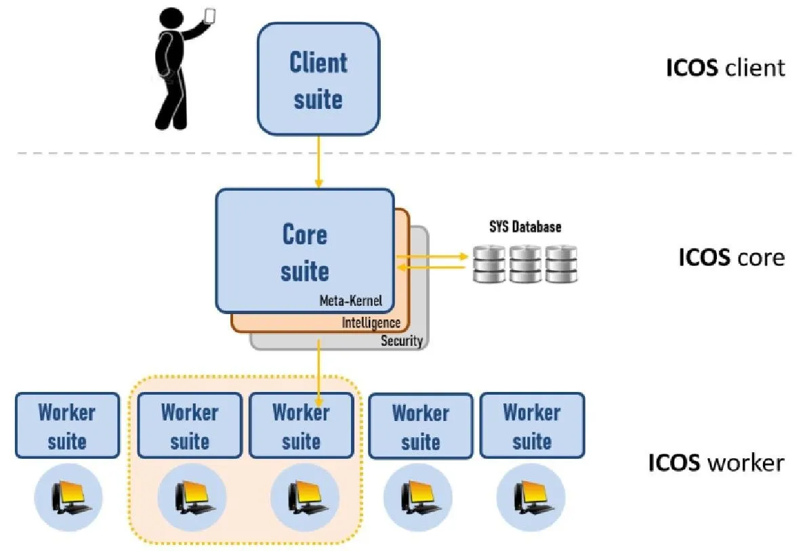

# ICOS Architecture

ICOS has been conceived as a dynamic metaOS platform distributed along the continuum. One major
design principle in ICOS is that it leverages both the cloud (almost unlimited computing and storage
capacity, ubiquity, ...) and the edge (locality exploitation, latency and communication reduction,
privacy preservation,...). In addition, ICOS is elastic, dynamic and mobile, allowing nodes to
dynamically join or leave the system according to their own interests, and being able to adapt to eventual
system topology changes.
ICOS is made up of two main types of nodes: the ICOS Controller and the ICOS Agent.

- The ICOS Controller is responsible for managing the continuum (keeping track of the current system
topology and availability) and the run-time (launching and monitoring the services execution on
demand). This is achieved through a three-layer architectural design, as described section 4.2 of the deliverable 
[D2.2 - ICOS Architecture Designe(IT-1)](https://www.icos-project.eu/files/deliverables/D2.2_ICOS_Design_v1.0.pdf).

- The ICOS Agent is responsible for executing offloaded users's services, taking care of code execution,
data access, telemetry, and, eventually, runtime communication between other Agents. This is further
described in section 4.2 of the deliverable [D2.2 - ICOS Architecture Design (IT-1)](https://www.icos-project.eu/files/deliverables/D2.2_ICOS_Design_v1.0.pdf).

ICOS Agents are distributed along the continuum and include from computation restricted devices at
the far edge to high performance computing resources at the cloud level. The ICOS system has been
designed to be able to provide a very large number of heterogeneous Agents and distributed over a wide
geographical area. To efficiently manage such a huge number of nodes, while exploiting the advantages
of locality, a set of ICOS Controllers should be deployed along the continuum to cover the whole
geographical area. ICOS Controllers are distributed with a flat, unstructured organisation.
Each Controller manages a set of Agents based on proximity criteria, shaping a highly distributed, flat,
unstructured control organisation. Controllers will keep track of the set of Agents assigned within its
scope (continuum management) and will satisfy the services requested (runtime management), giving
efficient reaction and leveraging locality features of the executed applications and services.
The ICOS multi-controller architecture provides several advantages: it leverages locality issues (latency
and communication reduction, privacy guarantee), facilitates system scalability and elasticity (by
allowing dynamic and mobile nodes) and becomes fault tolerant (no single point of failure). A typical
ICOS scenario can be viewed in the following Figure: 

<figure markdown="1">
{: style="width:600px; border: 2px solid white;"}
</figure>

# Functionali System Overview
ICOS Nodes, as initially defined in deliverable [D2.1 - ICOS ecosystem: Technologies,requirements and state of the art](https://www.icos-project.eu/files/deliverables/D2.1_ecosystem_and_of_art_v1.1.pdf), 
are infrastructure elements that will run the ICOS System software distribution and capable of communicating with other ICOS Nodes to realise a
unique, distributed, metaOS that will provide all the functionalities of ICOS.
The ICOS System is organised in three main layers: the Meta-Kernel, the Security, and the Intelligence
layers, plus two additional modules the ICOS Shell and Data Management as depicted in the following Figure: 
<figure markdown="1">
{: style="width:600px; border: 2px solid white;"}
</figure>
The Meta-Kernel Layer is responsible for providing the principal OS functionalities to the continuum
(Continuum Management, Runtime Management and Logging & Telemetry). It tightly integrates with
the Security Layer that has the responsibility of guaranteeing security and trust, as well as with the
Intelligence Layer that will enrich any action to be taken with innovative AI approaches. The Security
and Intelligence layers will also closely interact to improve the security-related analysis and actions
with AI models. The Data Management layer will allow the different components in the system to
communicate through secure and distributed data services, while the ICOS Shell will provide access to
the user to all system functionalities. 

## ICOS Shell

ICOS Shell exposes the ICOS services, by means of a graphical user interface (GUI) or a command-line interface (CLI), and it also provides a set of Development and Operations (DevOps) tools to facilitate the development lifecycle. Thus, ICOS shell provides an interface between the system administrator or the developer, and the proposed ICOS intelligence, security and meta-kernel layers. The ICOS shell module consists of three main components:

- The Administrative Graphical User Interface (Admin GUI): is an environment that will be used by systems administrators responsible for deployment and runtime management of apps, services and tasks provided by ICOS. The Admin GUI may be used to introspect and control the state of the apps, services and tasks, running in the intelligence, security and meta-kernel layers. 
- The Developers Command Line Interface (Dev CLI): is an environment that will provide interactive access to ICOS systems functions or services that are not available in the graphical interface.
- The DevOps tools: is a set of tools to facilitate coding, building, testing, packaging, releasing, configuring and monitoring of applications in the ICOS system as well as to provide automation tools for developers and system administrators.

<figure markdown="1">
{: style="width:600px; border: 2px solid white;"}
</figure>

More details in the deliverable [D2.2 ICOS Architecture Design (IT-1), section 4.2](https://www.icos-project.eu/files/deliverables/D2.2_ICOS_Design_v1.0.pdf).

## Distributed Meta-Kernel Layer

The Meta-Kernel Module provides the base functionalities necessary to make edge devices manageable and 
ICOS-ready. It is built on the following set of well defined components:

- **Runtime Manager**: responsible for ensuring the underlying devices to fulfill service requirements deployed 
from the upper layers of the ICOS ecosystem (i.e., the ICOS Shell) to provide a high-performance execution. 
For that purpose, the runtime manager will: 
	* convert the workload of the invocation into a workflow of tasks (including native methods, binaries, 
	containers, FaaS operations deployed beyond the ICOS ecosystem, etc.) and orchestrate their execution 
	by distributing them across the computing devices within the continuum; 
	* facilitate the deployment of optimized ICOS components partitioning, resource allocation and placement 
	functions, towards a green strategy enforcing policies like energy efficiency with special attention to green 
	energy or carbon usage effectiveness, location, infrastructure associated costs, etc.. 
In order to adapt to the rapidly changing infrastructure, the task scheduling system of the runtime manager 
will be provided with malleability and fault-tolerance mechanisms to quickly react to the changes.

- **Continuum Manager**: responsible for bootstrapping new devices into the ICOS continuum. It provides the mechanisms for: i) registering and activating the edge devices into ICOS Shell; ii) enabling the remote execution of management jobs, issued by users, allowing for on-demand management and re-configuration of the Meta-Kernel itself, as well as low-level operations such as real time configuration, kernel tunning or
updates/upgrades (including mechanisms to automatically enforce green strategies such as: offloading of computation-intensive tasks –from end users to edge nodes or the cloud–, configuring edge-device CPU processor, connectivity and bandwidth utilization, resources location, etc.); iii) configuring the edge device’s network such that secure remote access, multi-access edge computing and network attack surface protection can be enabled; iv) ensuring that the user workloads and the underlying device are performing according to the expectations mandated by pre-defined and configurable SLA criteria. The component also makes sure that failed workloads are rebalanced and quality is reinforced, and; v) discovering, labeling and categorizing both the underlying device and all relevant peripherals such as IoT sensors and actuators.

- **Logging and Telemetry**: responsible for collecting and uploading telemetry reports into ICOS Shell. 
Such logs shall be accessible both locally from within the edge device and remotely from the ICOS Shell. 
This component will also support the exchange of metrics and information between the Meta-kernel and user 
workloads.

<figure markdown="1">
{: style="width:600px; border: 2px solid white;"}
</figure>

## ICOS Platform delivery suites
Three different functional roles are envisioned in the ICOS system: 

* **system client**;

* **system core**; 

* **system workers**. 

For this reason, three delivery suites are provided accordingly. 

The system client may be either a user with a device or a device programmed to launch commands 
to the system. In either case, the Client suite contains the user's shell with basic operational 
commands (service launching, users' configuration, etc.),monitoring capabilities and, optionally, 
the development tools kit and an interactive GUI. 

The system core is the responsible for all system control and management tasks defined in the ICOS architecture, and includes Meta-Kernel layer, 
Security layer, and Intelligence layer. Consequently, the Core suite implements all these 
functionalities and is, by far, the most complex system component. 

The system workers shape the set of available running devices in ICOS to effectively execute all system service executions. 

The Worker suite is a lightweight component with the basic run-time libraries to enable the execution 
of off-loaded tasks and subtasks. Delivery suites will be installed in devices according to the 
device's role in the system, i.e., whether a client (Client suite), part of the system core 
(Core suite) or one of the multiple system workers (Worker suite). 

Each suite can be delivered as a complete package or delivered selectively as isolated components as part of the ICOS solution, 
to facilitate reuse and updating. Furthermore, note that a physical device can install more than one 
suite instance if desired, assuming several roles in the system. 
For instance, one can install a Client suite and a few Worker instances in a smartphone, a Core suite
 and several Worker instances in one server, or just a Worker instance in a low-power device.

<figure markdown="1">
{: style="width:600px; border: 2px solid white;"}
</figure>
